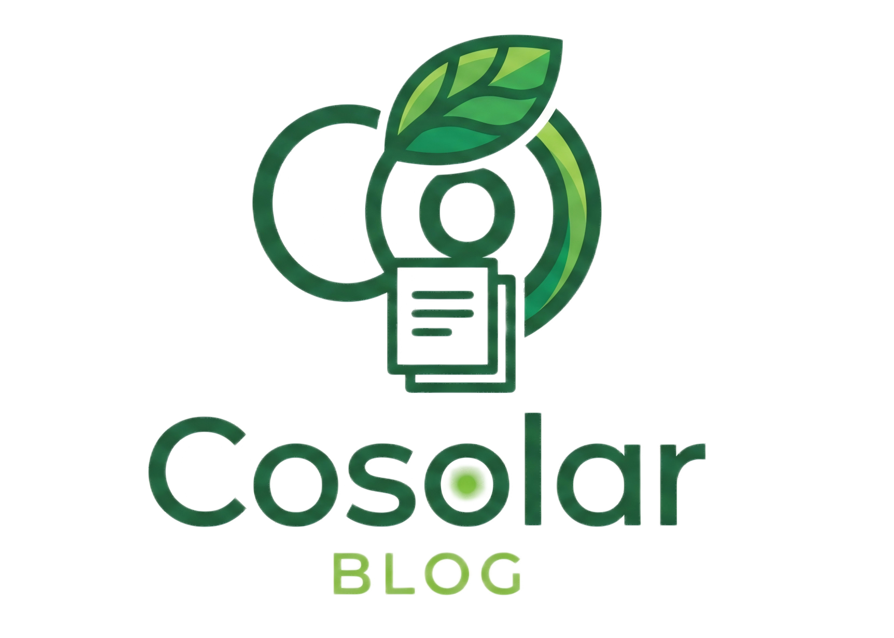

<div align="center">



# halo-theme-cosolar

### 极简不简单 — 面向开发者的现代 Halo 博客主题

**青绿美学** · **暗色模式** · **精选轮播** · **分类导航** · **全局搜索** · **完美移动端适配**

[](https://halo.run) [](LICENSE) [](https://github.com/cosolar/halo-theme-cosolar/releases) [](https://www.typescriptlang.org/) [](https://vitejs.dev/)

**🚀 [在线预览 →](https://note.minims.cn)** · **📘 [配置手册 / 使用教程](docs/使用教程.md)**

</div>

---

## ✨ 为什么选择 halo-theme-cosolar？

> 把「内容」放回舞台中央 —— 干净的排版、克制的动效、合理的留白，让代码与文字都能舒适呼吸。

市面上 Halo 主题很多，但专为**技术写作者**量身打造的却很少。halo-theme-cosolar 从开发者的真实阅读场景出发，打磨了每一个交互细节：

| 🤔 痛点                | ✅ halo-theme-cosolar 的解法                            |
| ---------------------- | ------------------------------------------------------- |
| 长文阅读找不到方向     | 阅读进度条 + 悬浮目录（TOC），随时知道"在哪、还有多远"  |
| 代码块在暗色模式下刺眼 | 三档配色切换 + 毛玻璃导航栏，深夜码字也舒适             |
| 手机阅读体验割裂       | 贴底毛玻璃操作栏、抽屉式目录、自动隐藏侧边栏            |
| 精选好文淹没在列表里   | 首页精选轮播卡片，手动指定 / 自动播放 / 置顶回退        |
| 想换个颜色又怕改坏     | 后台一键换色，全站按钮 / 链接 / 标签 / 进度条联动       |
| 文章图片太小看不清     | 零依赖图片查看器，滚轮缩放 / 拖动 / 双击复位 / ESC 关闭 |

---

## 🎯 功能全览

### 🎨 视觉与主题

- **青绿美学** — 默认主色 `#10B981`，后台一键换色，全站联动
- **暗色模式** — 跟随系统 / 强制浅色 / 强制暗色三档可切
- **毛玻璃风格** — 导航栏与操作栏 `backdrop-filter` 毛玻璃质感
- **页面背景** — 支持自定义背景图（浅色/深色分别配置）和 5 种动态渲染背景

### 🖼️ 首页体验

- **精选轮播** — 首页顶部卡片轮播，手动指定文章、自动播放、置顶回退
- **文章卡片** — 封面图 + 标题 + 摘要 + 分类标签 + 时间，信息密度恰到好处
- **侧边栏** — 博主信息 / 公告栏 / 热门标签（词云） / 公众号二维码 / 分类导航 / 近期更新，模块化可单独开关

### 📖 阅读体验

- **文章目录（TOC）** — 桌面端右侧悬浮跟随，移动端抽屉式弹出，1px 极细滚动条
- **阅读进度条** — 顶部 2px 彩色渐变，实时反映阅读位置
- **图片查看器** — 点击放大，滚轮缩放 / 拖动 / 双击复位 / ESC 关闭，零依赖
- **点赞 / 评论 / 分享 / 回顶** — 文章页底部贴底毛玻璃横条，5 按钮平分宽度

### 📱 移动端适配

- **≤768px** — 侧边栏自动隐藏，导航收起为汉堡菜单，操作栏贴底
- **≤480px** — 小屏进一步紧凑，按钮间距收窄
- **769–1024px** — 平板隐藏 TOC 列，保留内容 + 侧边栏双栏

### 🔧 个性化

- **自定义字体** — 支持引入第三方字体 CSS，一键切换全局字体
- **自定义图标** — 支持 Remix Icon、Font Awesome 等第三方图标库
- **自定义背景** — 背景图浅色/深色分别配置，5 种 Canvas 动态背景可选
- **封面图配置** — 分类页、标签页、归档页 Hero 区域均可自定义封面图

### 👤 账号体系（登录 / 注册 / 登出）

- **登录页** — 青绿美学左右分栏布局，左侧品牌展示区 + 右侧表单卡片，支持本地账号登录、其他登录方式、社交登录，含「记住我」「忘记密码」入口
- **注册页 / 登出页** — 复用同一套分栏布局，提供账号注册与退出确认
- **登录页可定制** — 后台可配置左侧品牌区占比、遮罩层开关与渐变主色/透明度（明暗双模各自可配）
- **主题色防闪烁** — 明暗切换时自动应用已保存的主题，避免白屏闪烁

### 🔗 友情链接页面

- **独立友链页** — Hero 双栏 + 友链/分组统计，展示所有友情链接
- **分组筛选 + 实时搜索** — 前端即时筛选，无需整页跳转
- **链接状态徽章** — 在线 / 离线 / 检测中、已回链 / 未回链一目了然
- **申请友链 CTA** — 一键邮件申请交换友链

### 📰 RSS 资讯页面

- **聚合订阅动态** — 三栏布局：左频道导航、中资讯流、右统计面板（资讯概览 / 活跃频道 / 抓取状态）
- **筛选与分页** — 支持按订阅源 / 分组筛选、分页「加载更多」
- **依赖友情链接插件的 RSS** — 未启用时给出友好引导提示

---

## 📸 预览

**🚀 演示站点：** [https://note.minims.cn](https://note.minims.cn)

<table>
<tr>
<td></td>
<td></td>
</tr>
<tr>
<td></td>
<td></td>
</tr>
<tr>
<td></td>
<td></td>
</tr>
</table>

---

## 🚀 安装与启用

### 环境要求

| 项目 | 版本       |
| ---- | ---------- |
| Halo | `>=2.20.0` |

### 依赖插件

本主题的**友情链接页面**与 **RSS 资讯页面**依赖 Halo 官方链接管理插件 **plugin-links**（Halo 2.0 的链接管理插件，用于管理友情链接、检查链接状态，并将链接站点的 RSS / Atom 动态聚合到 Halo Console 中）。

| 插件             | 用途                                                                                         | 必需度                                  |
| ---------------- | -------------------------------------------------------------------------------------------- | --------------------------------------- |
| `plugin-links`   | 管理友情链接、检测链接可访问性与回链状态、聚合友站 RSS / Atom 动态到 Halo Console            | 友情链接页、侧边栏友链/订阅模块、RSS 资讯页**必需** |

> ⚠️ **未安装 `plugin-links` 时的表现**：
>
> - 友情链接页仍可访问，但列表为空（无数据可展示）
> - 侧边栏「友情链接」「订阅资讯」模块不显示
> - RSS 资讯页会显示「RSS 资讯功能未启用」的引导提示
>
> 安装并启用插件后，需在插件设置的「RSS 订阅」中开启「公开 RSS 订阅动态」，RSS 资讯页与侧边栏订阅模块才会有内容。

此外，搜索功能依赖官方搜索插件（详见下文「搜索功能」一节）。

### 方式一：直接安装（推荐）

1. 前往 [Releases](https://github.com/cosolar/halo-theme-cosolar/releases) 下载最新 `cosolar-<version>.zip`
2. 登录 Halo 后台，进入 **主题管理 → 安装主题** → 上传 ZIP
3. 安装完成后点击 **启用** 🎉

### 方式二：从源码构建

> 适用于需要二次开发或自定义修改的场景。

```bash
git clone https://github.com/cosolar/halo-theme-cosolar.git
cd halo-theme-cosolar
pnpm install
pnpm build            # 产物：templates/ + cosolar-<version>.zip
```

将生成的 ZIP 上传到 Halo，或将整个目录放入 Halo 工作目录的 `themes/cosolar/` 下。

---

## 📖 使用教程

完整的**逐项配置手册**已整理到 [**使用教程.md**](docs/使用教程.md)，涵盖全部 14 个设置分组（基础 / 页脚 / 主题样式 / 博主信息 / 首页轮播 / 侧边栏 / 分类 / 标签 / 归档 / 友链 / RSS / 浅色背景 / 深色背景 / 登录页）每个字段的**类型、默认值、取值范围与配置建议**，以及菜单图标、文章自定义阅读地址等设置界面之外的功能。

> 主题启用后，进入 **Halo 后台 → 主题管理 → halo-theme-cosolar → 设置** 即可按分组配置。

快速上手要点：

- **基础 / 页脚** — Logo、站点名、标语、版权、ICP、页脚链接
- **主题样式** — 一键换主题色、选明暗方案、调布局宽度、换字体 / 图标库
- **首页轮播** — 指定精选文章，或设置回退策略（最新 / 置顶）
- **侧边栏** — 按需开关博主卡 / 公告 / 标签云 / 公众号 / 分类 / 友链 / RSS，并拖拽排序
- **页面背景** — 浅色 / 深色分别配置纯色、背景图或 5 种动态背景
- **分类 / 标签 / 归档 / 友链 / RSS / 登录页** — 配置封面图、标题与页面参数

逐项说明、字段默认值与常见问题，请查阅 [使用教程.md](docs/使用教程.md)。

---

## ❓ 常见问题

### 如何关闭模板缓存以便开发调试？

- **Docker 部署**：添加环境变量 `SPRING_THYMELEAF_CACHE=false`
- **源码部署**：在 `application.yaml` 中设置 `spring.thymeleaf.cache: false`

### 代码高亮如何配置？

代码高亮由 Halo 的 `plugin-shiki` 插件负责，在 **Halo 后台 → 插件管理 → Shiki → 设置** 中配置亮色/暗色主题，主题本身不再提供代码高亮选项。

### 如何完全离线部署？

1. 下载 [lxgw-wenkai-screen-webfont](https://github.com/lxgw-wenkai-webfont) 字体文件
2. 上传到 Halo 附件管理
3. 在 **字体设置** 中将「字体 CSS 地址」替换为上传后的本地路径
4. 图标字体已内置在主题中，无需额外处理

### 动态背景会影响性能吗？

动态背景使用 Canvas 2D 渲染，粒子数量会根据屏幕尺寸自动调整（最多 80 个粒子 / 150 颗星星），对现代设备几乎无性能影响。如仍有顾虑，可降低透明度或切换为静态背景图。

### 如何让文章出现在精选轮播中？

两种方式：

1. **手动指定**：在「精选文章」设置中直接选择文章
2. **自动回退**：将文章设为置顶，然后选择回退策略为「显示置顶文章」

### 博主信息卡片的背景图和背景色有什么区别？

- **背景图**：适合使用深色图片，文字会自动变为白色，并添加半透明遮罩确保可读性
- **背景色**：适合使用纯色或渐变色，效果更简洁
- 两者同时设置时，背景图优先

### 为什么友情链接 / RSS 资讯页面没有内容？

这两个页面依赖 Halo 官方链接管理插件 **plugin-links**：

1. 确认已在 Halo 后台 **插件管理** 中安装并启用 `plugin-links`
2. 友情链接需在插件中添加链接数据；RSS 资讯还需在插件「RSS 订阅」设置中开启「公开 RSS 订阅动态」
3. 未安装插件时，友情链接页列表为空、RSS 资讯页会显示「RSS 资讯功能未启用」提示；侧边栏的「友情链接」「订阅资讯」模块也会自动隐藏

### 侧边栏模块顺序如何调整？

在 **主题设置 → 侧边栏设置 → 侧边栏模块顺序** 中，以列表形式拖拽每行即可调整上下顺序；删除某行可隐藏该模块，点击「添加模块」可重新加入。各模块单独的「显示 XX 模块」开关用于临时显隐，不影响已设定的顺序。

---

## 🛠️ 开发

```bash
pnpm install
pnpm dev              # 监听文件变化，实时构建到 templates/
pnpm check            # 检查模板与配置
pnpm build-only       # 仅构建（不打 ZIP），用于本地联调
pnpm build            # 完整构建 + 打 ZIP 包
```

---

## 📐 响应式断点

| 断点         | 布局     | 行为                             |
| ------------ | -------- | -------------------------------- |
| `> 1024px`   | 三栏     | 内容 + 侧边栏 + TOC              |
| `769–1024px` | 双栏     | 内容 + 侧边栏（隐藏 TOC）        |
| `≤ 768px`    | 单栏     | 侧边栏隐藏，汉堡菜单，操作栏贴底 |
| `≤ 480px`    | 紧凑单栏 | 按钮间距进一步收窄               |

---

## 🗺️ 路线图

- [ ] i18n 多语言（中 / 英）
- [ ] 搜索结果页模板
- [ ] 404 / 500 错误页美化
- [ ] 文章系列/专栏支持
- [ ] 首页布局模式切换（列表 / 瀑布流）

---

## 🤝 贡献

欢迎提 Issue 与 PR！无论是 Bug 反馈、功能建议还是代码贡献，都让 halo-theme-cosolar 变得更好。

1. Fork 本仓库
2. 新建分支：`git checkout -b feat/your-feature`
3. 提交：`git commit -m "feat: ..."`（遵循 [Conventional Commits](https://www.conventionalcommits.org/)）
4. 推送并提交 Pull Request

---

## 🔒 第三方服务资源

本主题在页面加载时可能请求以下第三方资源：

| 服务商           | 资源                                                                  | 用途             | 触发条件             |
| ---------------- | --------------------------------------------------------------------- | ---------------- | -------------------- |
| npm.elemecdn.com | [LXGW WenKai Screen](https://github.com/lxgw-wenkai-webfont) 中文字体 | 页面中文排版     | 仅默认字体配置时加载 |
| 自定义 CDN       | 第三方字体 / 图标库                                                   | 自定义排版和图标 | 用户主动配置后加载   |

> **说明**：
>
> - 默认配置下，iconfont 图标字体已完全本地化，霞鹜文楷字体通过 elemecdn 公共 CDN 按需加载
> - 如需完全离线部署，可在后台 **字体设置** 中将字体 CSS 地址替换为本地路径
> - 如配置了第三方图标库（如 Font Awesome、Remix Icon），浏览器将向对应 CDN 请求资源

---

## 📄 许可证

[GPL-3.0](LICENSE)

---

## 💝 致谢

- [Halo](https://halo.run) — 强大易用的开源建站平台
- 所有为本主题提过 Issue 与建议的用户

---

<div align="center">

**如果 halo-theme-cosolar 对你有帮助，给个 ⭐ Star 吧！**

</div>
