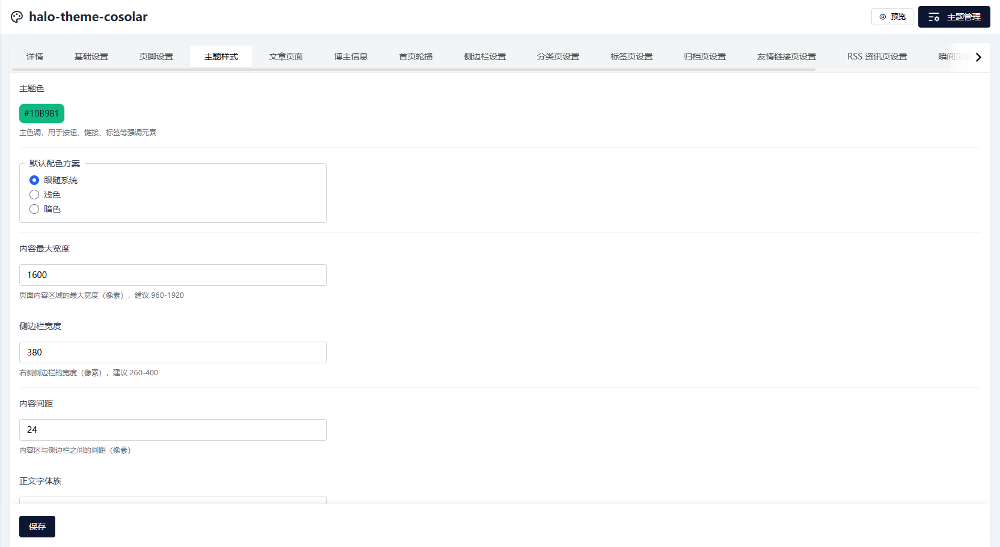
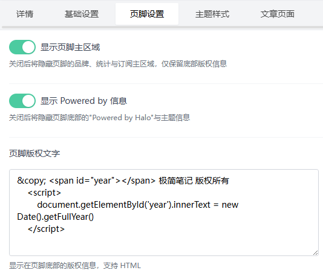
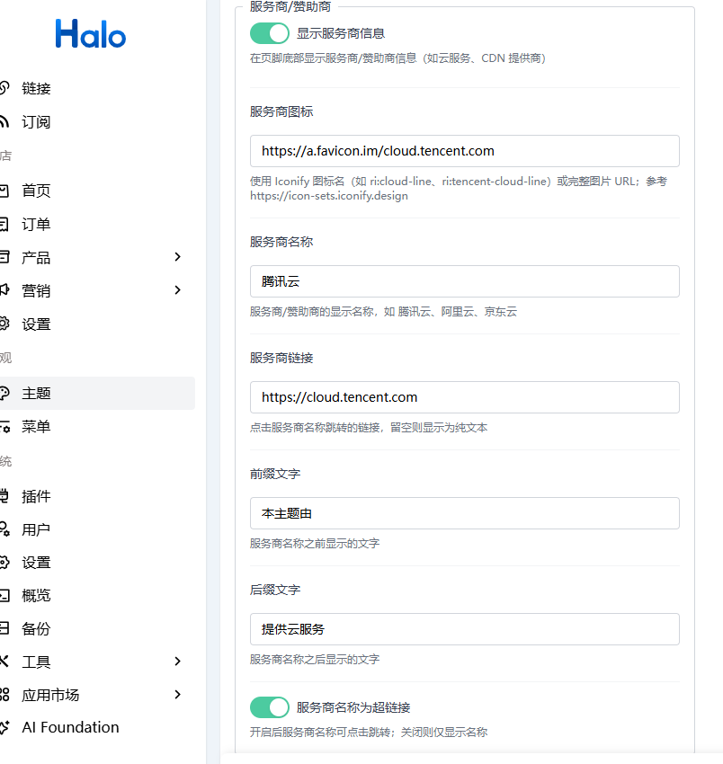
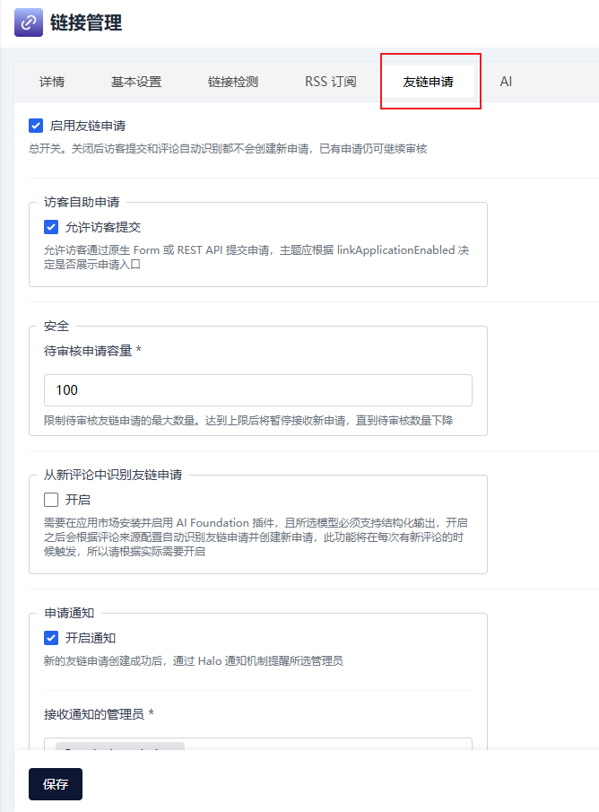
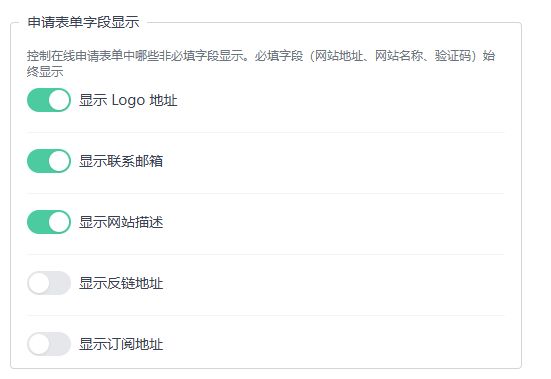
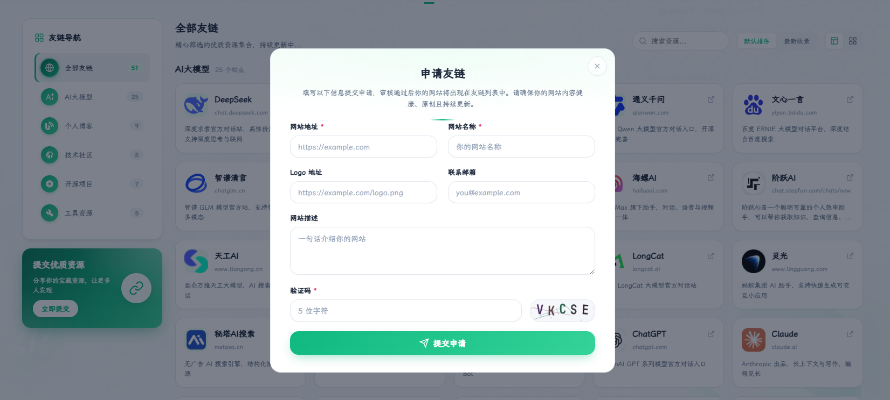
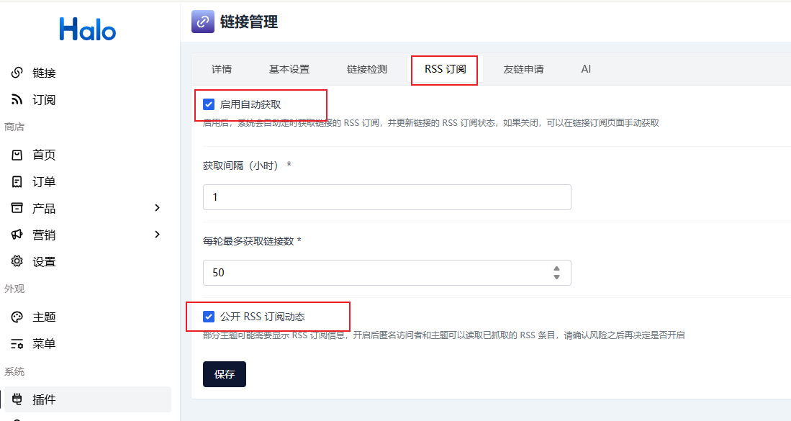
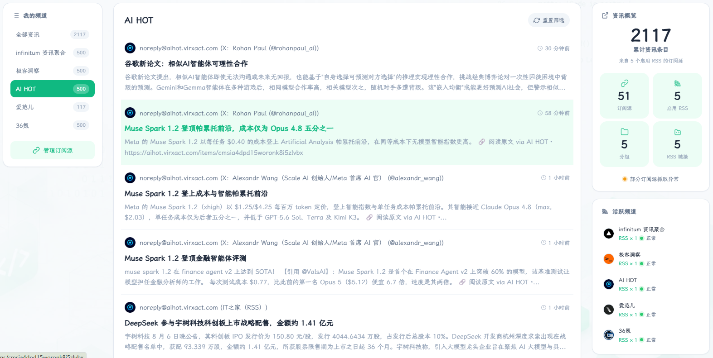
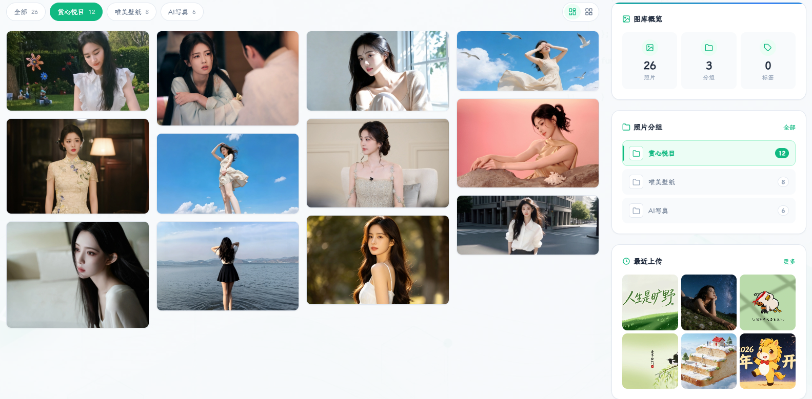

# halo-theme-cosolar 主题使用与配置手册

> 一款为开发者打造的现代 Halo 博客主题：青绿美学、明暗双模、精选轮播、动态背景、全局搜索、完美移动端适配。
>
> 适用版本：Halo `>= 2.20.0` ｜ 主题版本：`1.1.3`（本手册以此版本为准）

本手册以主题后台 **设置（cosolar-setting）** 中的全部配置项为基准，逐项说明每个字段的含义、默认值、取值范围与配置建议；并补充菜单图标、文章注解、依赖插件等「设置界面之外」的实用功能。读完即可独立完成从安装到精调的全过程。



---

## 目录

1. [安装与启用](#1-安装与启用)
2. [配置入口与基本概念](#2-配置入口与基本概念)
3. [基础设置（basic）](#3-基础设置basic)
4. [页脚设置（footer）](#4-页脚设置footer)
5. [主题样式（style）](#5-主题样式style)
6. [博主信息（social）](#6-博主信息social)
7. [首页轮播（featured）](#7-首页轮播featured)
8. [侧边栏设置（sidebar）](#8-侧边栏设置sidebar)
9. [分类页设置（category）](#9-分类页设置category)
10. [标签页设置（tag）](#10-标签页设置tag)
11. [归档页设置（archive）](#11-归档页设置archive)
12. [友情链接页设置（links）](#12-友情链接页设置links)
13. [RSS 资讯页设置（feeds）](#13-rss-资讯页设置feeds)
14. [图库页设置（photos）](#14-图库页设置photos)
15. [页面背景（background）](#15-页面背景background)
16. [登录页面（login）](#16-登录页面login)
17. [文章页面（post）](#17-文章页面post)
18. [菜单图标配置（注解）](#18-菜单图标配置注解)
19. [文章自定义阅读地址（注解）](#19-文章自定义阅读地址注解)
20. [友情链接分组图标（注解）](#20-友情链接分组图标注解)
21. [依赖插件与搜索](#21-依赖插件与搜索)
22. [常见问题](#22-常见问题)
23. [附录：响应式断点与版本约定](#23-附录响应式断点与版本约定)

---

## 1. 安装与启用

### 环境要求

| 项目 | 要求 |
| ---- | ---- |
| Halo | `>= 2.20.0` |
| Node / pnpm（仅源码构建） | Node `>= 18`、pnpm `>= 8` |
| 浏览器 | 现代浏览器（Chrome / Edge / Firefox / Safari 最近两个大版本） |

### 方式一：上传 ZIP（推荐）

1. 在主题 Release 页面下载最新 `cosolar-<version>.zip`（也可使用本仓库 `dist/` 目录下打包好的 zip）。
2. 登录 Halo 后台，进入 **主题管理 → 安装主题**，选择「上传主题」并选择 ZIP 文件。
3. 安装完成后，在主题列表找到 **halo-theme-cosolar**，点击 **启用**。
4. 启用后访问站点首页，应能看到默认青绿配色与动态背景效果。

> 小贴士：若上传时报「主题已存在」，可在主题管理界面先卸载旧版本再上传；或直接覆盖安装（保留你已配置的设置项）。

### 方式二：源码构建

适合二次开发或需要本地预览的用户。

```bash
# 1. 安装依赖（pnpm install 会自动触发 prepare 脚本完成初始化）
pnpm install

# 2. 开发模式：监听 src/ 变化并实时输出到 templates/
pnpm dev

# 3. 验证编译是否通过（类型检查 + 构建）
pnpm build-only

# 4. 正式构建，产物包括 templates/ 与 dist/cosolar-<version>.zip
pnpm build
```

构建完成后，将 `dist/halo-theme-cosolar.zip` 上传到 Halo；或直接把整个项目目录放入 Halo 工作目录的 `themes/halo-theme-cosolar/` 下，再到后台启用。

### 方式三：Halo 应用市场

若主题已上架 Halo 应用市场，可在后台 **主题管理 → 安装主题 → 应用市场** 中搜索 `cosolar`，点击安装即可（最省事，但版本可能略落后于 GitHub Release）。

### 启用后必做事项

| 步骤 | 目的 |
| --- | --- |
| 进入 **外观 → 菜单**，新建或导入菜单 | 主题导航栏依赖 Halo 菜单系统，无菜单时导航为空 |
| 进入 **设置 → 主题设置 → halo-theme-cosolar**，填写 Logo 文字、标语等 | 留空虽可用默认值，但站点身份信息建议尽早填写 |
| 安装 `plugin-links`（如需友链 / RSS 资讯页） | 见 [21. 依赖插件与搜索](#21-依赖插件与搜索) |
| 安装 `PluginSearchWidget`（如需全局搜索框） | 同上 |

---

## 2. 配置入口与基本概念

启用主题后，进入 **Halo 后台 → 主题管理 → halo-theme-cosolar → 设置**，即可看到按分组排列的所有配置项。每个分组对应 `settings.yaml` 中的一个 `formSchema`，分组名（如 `basic`、`footer`）即为内部键名。

### 三个重要约定

> **约定一：留空即默认**
>
> 绝大多数文本 / 图片 / 颜色字段留空时，主题会使用内置默认效果（如默认 `</>` 代码图标 Logo、默认青绿渐变背景、默认字体等）。**不确定时先留空观察效果**，比盲目填一个值更安全。

> **约定二：明暗双模独立**
>
> 背景图、博主卡片、页脚、登录页等视觉项普遍提供「浅色模式 / 深色模式」两套独立配置。当访客或系统切换主题时，会自动套用对应的一套，两套互不影响。**如果你只想配置浅色模式，深色模式那栏可以全部留空**（主题会回退到合理的默认值）。

> **约定三：附件字段值是 URL**
>
> 所有 `$formkit: attachment` 类型的字段，后台表现为「上传图片」按钮，存储的值是该图片在 Halo 中的访问 URL。在模板中可直接 `src="${theme.config?.footer?.bg_image}"` 使用。

### 配置项表格说明

下文每个分组的配置项均以表格形式列出，列含义如下：

| 列名 | 含义 |
| --- | --- |
| 配置项 | 后台显示的配置项名称 |
| 字段名 | 内部键名，便于高级用户对照 `../settings.yaml` |
| 类型 | `text` 文本 / `textarea` 多行文本 / `number` 数字 / `range` 滑块 / `color` 颜色 / `attachment` 附件 / `switch` 开关 / `select` 下拉 |
| 默认值 | 字段留空时的内置默认值（来自 `settings.yaml` 的 `value`） |
| 说明与建议 | 字段作用、取值范围、配置建议 |

---

## 3. 基础设置（basic）

配置站点身份信息，显示在导航栏左侧与全局。

| 配置项 | 字段名 | 类型 | 默认值 | 说明与建议 |
| --- | --- | --- | --- | --- |
| Logo 图片 | `logo_image` | 附件 | 空 | 导航栏左侧 Logo；留空显示 `</>` 代码图标。建议透明背景 PNG / SVG，源图尺寸 72–160px |
| Logo 图片宽度 | `logo_image_width` | 数字 | 36 | 显示宽度（px），范围 20–80，步长 2。建议等于或略小于高度 |
| Logo 图片高度 | `logo_image_height` | 数字 | 36 | 显示高度（px），范围 20–80，步长 2 |
| Logo 文字 | `logo_text` | 文本 | `码迹志` | 导航栏紧邻 Logo 的站点名称，2–6 个字最佳；过长会在窄屏截断 |
| 站点标语 | `tagline` | 文本 | `记录技术成长，分享解决方案` | Logo 文字下方的小号副标题，可留空隐藏 |

### 配置示例

- **纯文字站点**：`logo_image` 留空，`logo_text` 填 `码迹志`，`tagline` 填一句话简介。导航栏将显示 `</>` 图标 + 文字 + 标语。
- **带图片 Logo**：上传一张透明 PNG，设 `logo_image_width=40`、`logo_image_height=40`，`logo_text` 留空或填站点名。

> 页脚版权文字（`footer_text`）与 ICP 备案号（`icp`）已迁移至「页脚设置」分组，本组不再包含。

---

## 4. 页脚设置（footer）

控制页脚的品牌区、统计区、订阅区、底部版权与备案信息。页脚同样区分浅色 / 深色两套背景配置。

### 4.1 通用页脚配置

| 配置项 | 字段名 | 类型 | 默认值 | 说明与建议 |
| --- | --- | --- | --- | --- |
| 显示页脚主区域 | `show_footer_main` | 开关 | true | 关闭后隐藏页脚的品牌、统计、订阅主区域，仅保留底部版权信息 |
| 显示 Powered by 信息 | `show_footer_powered` | 开关 | true | 关闭后隐藏页脚底部的「Powered by Halo」与主题信息 |
| 页脚版权文字 | `footer_text` | 多行文本 | 空 | 页脚底部的版权信息，**支持 HTML**，可插入链接、图标等 |
| ICP 备案号 | `icp` | 文本 | 空 | 如：`京ICP备XXXXXXXX号`；会自动生成到工信部备案查询的链接 |
| 页脚 Logo 图片 | `logo_image` | 附件 | 空 | 页脚品牌区显示的 Logo；留空则回退到「基础设置」中的 Logo 或默认 `</>` 图标 |
| 页脚 Logo 宽度 | `logo_image_width` | 数字 | 36 | 范围 20–80，步长 2 |
| 页脚 Logo 高度 | `logo_image_height` | 数字 | 36 | 范围 20–80，步长 2 |
| 页脚 Logo 显示名称 | `logo_text` | 文本 | 空 | 页脚品牌区显示的名称；留空回退到「基础设置」的 `logo_text` |
| 页脚标语 | `tagline` | 文本 | 空 | 页脚品牌区标语；留空回退到站点标语 |
| 页脚站点简介 | `footer_description` | 多行文本 | 空 | 页脚品牌区下方的站点简介；留空回退到页脚标语 |



### 4.2 浅色模式（footer.light）

| 配置项 | 字段名 | 类型 | 默认值 | 说明与建议 |
| --- | --- | --- | --- | --- |
| 页脚背景图片 | `bg_image` | 附件 | 空 | 建议浅色调、低饱和度图片，避免影响内容阅读；留空则不显示背景图 |
| 背景图片透明度 | `bg_image_opacity` | 滑块 | 0.2 | 范围 0.05–1，值越小背景图越淡，文字越清晰 |

### 4.3 深色模式（footer.dark）

| 配置项 | 字段名 | 类型 | 默认值 | 说明与建议 |
| --- | --- | --- | --- | --- |
| 页脚背景图片 | `bg_image` | 附件 | 空 | 深色模式下建议使用低调暗色背景图 |
| 背景图片透明度 | `bg_image_opacity` | 滑块 | 0.2 | 同浅色模式 |

### 4.4 服务商/赞助商

图标可以使用：https://a.favicon.im/{域名} 如：https://a.favicon.im/cloud.tencent.com


### 配置示例

- **最简页脚**：`show_footer_main` 关闭，仅保留底部一行版权（`footer_text` 填 `© 2026 码迹志`）。
- **完整品牌页脚**：上传页脚 Logo，填站点标语与简介，开启 `show_footer_main` 与 `show_footer_powered`。
- **带备案号**：`icp` 填 `京ICP备12345678号-1`，页脚底部会自动渲染为可点击的工信部链接。

> `footer_text` 支持 HTML，但请勿粘贴未受信任的脚本；Halo 的设置值不会自动转义，主题模板会按 HTML 渲染。

---

## 5. 主题样式（style）

控制全站主题色、版式宽度、字体、图标库等基础视觉变量。这是个性化最直接的一组配置。

| 配置项 | 字段名 | 类型 | 默认值 | 说明与建议 |
| --- | --- | --- | --- | --- |
| 主题色 | `primary_color` | 颜色 | `#10B981` | 主色调，用于按钮、链接、标签、选中态等强调元素。建议使用与默认青绿系相近的色相，避免与正文颜色冲突 |
| 默认配色方案 | `color_scheme` | 单选 | `auto`（跟随系统） | 可选 `auto` / `light` / `dark`。`auto` 会根据访客系统偏好自动切换明暗 |
| 内容最大宽度 | `content_width` | 数字 | 1600 | 页面内容区最大宽度（px），范围 960–1920，步长 20。文字密度高的博客建议 1200–1400 |
| 侧边栏宽度 | `sidebar_width` | 数字 | 320 | 右侧侧边栏宽度（px），范围 260–400，步长 10 |
| 内容间距 | `content_gap` | 数字 | 24 | 内容区与侧边栏之间的间距（px），范围 12–48，步长 2 |
| 正文字体族 | `font_family` | 文本 | 空 | 自定义正文字体族（CSS `font-family` 语法）；留空使用默认霞鹜文楷。例：`"Noto Sans SC", sans-serif` |
| 字体 CSS 地址 | `font_css_url` | URL | 空 | 第三方字体 CSS 链接（Google Fonts、字节跳动 FontAPI 等）；留空使用默认霞鹜文楷 CDN |
| 等宽字体族 | `mono_family` | 文本 | 空 | 自定义代码 / 等宽字体族；留空使用默认 JetBrains Mono |
| 等宽字体 CSS 地址 | `mono_css_url` | URL | 空 | 第三方等宽字体 CSS 链接；留空则不额外加载 |
| 图标库 | `icon_provider` | 单选 | `iconify` | `iconify`（图标最全，开箱即用）或 `iconfont`（自定义图标，需在 iconfont.cn 创建项目） |
| iconfont CSS 地址 | `icon_css_url` | URL | 空 | 仅 `iconfont` 模式生效，填自建 iconfont 项目 CSS 地址。Iconify 模式下忽略 |

### 配置示例

**示例一：经典青绿（默认）**
- `primary_color` = `#10B981`，`color_scheme` = `auto`，字体全留空。
- 效果：默认青绿配色，跟随系统明暗，霞鹜文楷正文 + JetBrains Mono 代码。

**示例二：自托管字体（完全离线）**
1. 下载字体文件，上传到 Halo **附件管理**。
2. 复制附件 URL，将其填入 `font_css_url`（如果只有字体文件而非 CSS，可自建一个 `@font-face` CSS 文件并上传）。
3. `font_family` 填写对应的字体族名称，如 `"LXGW WenKai", serif`。

**示例三：改用 iconfont 自定义图标**
1. 在 [iconfont.cn](https://www.iconfont.cn) 创建项目，添加所需图标，发布得到 CSS 地址（形如 `https://at.alicdn.com/t/c/xxx.css`）。
2. `icon_provider` 设为 `iconfont`，`icon_css_url` 填上一步地址。
3. 此后所有图标类名按 iconfont 规则填写（如 `icon-github`）。菜单图标见 [18. 菜单图标配置](#18-菜单图标配置注解)。

> **代码高亮**：代码高亮主题由 Halo 官方 `plugin-shiki` 插件在后台配置（亮色 / 暗色主题），主题本身不提供该选项。请确保已安装该插件，并在插件设置中选择合适的亮暗高亮主题。

---

## 6. 博主信息（social）

显示在页脚博主卡片与侧边栏博主卡片上的个人信息。`author_social_links` 为可增删的数组，每个元素是一个社交图标。

### 6.1 基础信息

| 配置项 | 字段名 | 类型 | 默认值 | 说明与建议 |
| --- | --- | --- | --- | --- |
| 博主昵称 | `author_name` | 文本 | 空 | 页脚博主卡片的昵称；留空使用站点标题 |
| 博主头像 | `author_avatar` | 附件 | 空 | 建议 1:1 方形图，源图 ≥ 200×200 |
| 博主简介 | `author_bio` | 多行文本 | 空 | 一句话简介，建议 ≤ 50 字 |
| 博主所在地 | `author_location` | 文本 | 空 | 如 `中国·深圳` |
| 博主个人网站 | `author_website` | URL | 空 | 点击昵称 / 头像跳转的地址 |
| 建站时间 | `author_join_date` | 文本 | 空 | 如 `2023-01-01`，部分模块会以此计算「已运营 N 天」 |

### 6.2 社交图标（`author_social_links`）

每一行代表一个社交图标，可拖拽排序、增删。

| 子项 | 字段名 | 类型 | 默认值 | 说明 |
| --- | --- | --- | --- | --- |
| 显示此图标 | `enabled` | 开关 | true | 关闭后该图标不渲染（与删除等效，但保留配置） |
| 名称 | `name` | 文本 | 空 | 鼠标悬停提示文字，如 `GitHub`、`邮箱`、`RSS` |
| 链接地址 | `url` | URL | 空 | 点击跳转地址；邮箱写 `mailto:xxx@example.com`，RSS 写 `/feed.xml` |
| 图标名 | `icon_name` | 文本 | 空 | 按所选图标库填写。Iconify 填 `mdi:github`，iconfont 填 `icon-github` |

### 配置示例

```
图标 1：enabled=true, name=GitHub,    url=https://github.com/yourname, icon_name=mdi:github
图标 2：enabled=true, name=邮箱,      url=mailto:hi@example.com,      icon_name=mdi:email-outline
图标 3：enabled=true, name=RSS,       url=/feed.xml,                  icon_name=mdi:rss
```

> 数组上限 20 个；若图标不显示，先检查 `icon_name` 是否与当前 `icon_provider`（见 [5. 主题样式](#5-主题样式style)）匹配，再到对应图标库站点核对名称拼写。

---

## 7. 首页轮播（featured）

控制首页顶部的精选文章轮播卡片，以及首页文章列表的加载方式。

### 7.1 轮播开关与封面

| 配置项 | 字段名 | 类型 | 默认值 | 说明与建议 |
| --- | --- | --- | --- | --- |
| 启用精选轮播 | `show_featured` | 开关 | true | 关闭后首页不显示轮播区，文章列表直接铺开 |
| 轮播默认背景图 | `featured_cover` | 附件 | 空 | 所有轮播卡片共用的默认背景图；留空使用主题内置默认背景 |
| 优先使用文章封面 | `featured_cover_fallback` | 开关 | false | 开启后，若文章本身有封面图则优先使用，否则回退到上方默认背景图 |

### 7.2 精选内容与节奏

| 配置项 | 字段名 | 类型 | 默认值 | 说明与建议 |
| --- | --- | --- | --- | --- |
| 精选文章列表 | `featured_posts` | postSelect（多选） | 空 | 在首页轮播展示的文章，可拖拽排序；选中文章数受 `featured_max_count` 限制 |
| 自动轮播 | `autoplay` | 开关 | true | 开启后卡片自动切换 |
| 轮播间隔（毫秒） | `interval` | 数字 | 5000 | 自动轮播切换间隔，最小 1000，步长 500。常用 4000–6000 |
| 轮播最大文章数 | `featured_max_count` | 数字 | 5 | 范围 1–10，步长 1。超过此数的精选文章不会显示 |
| 无配置时的回退策略 | `fallback` | 单选 | `latest`（显示最新文章） | 可选 `latest` / `pinned`（置顶）/ `none`（不显示） |

### 7.3 首页加载方式与移动端

| 配置项 | 字段名 | 类型 | 默认值 | 说明与建议 |
| --- | --- | --- | --- | --- |
| 首页加载方式 | `home_load_mode` | 单选 | `pagination`（分页） | `pagination`：点击翻页切换（保留轮播图）；`scroll`：滚动到底部自动加载更多（同时保留手动「查看更多文章」按钮作为兜底） |
| 移动端轮播图仅显示封面 | `mobile_carousel_cover_only` | 开关 | false | 开启后，移动端（≤768px）轮播只展示封面图，隐藏标题、摘要、标签、按钮等文字内容 |

### 配置示例

**示例一：自动播放 5 篇精选**
- `show_featured=true`、`autoplay=true`、`interval=5000`、`featured_max_count=5`。
- 在 `featured_posts` 选择 3–5 篇文章并排序。

**示例二：纯滚动流首页**
- `home_load_mode=scroll`，`show_featured=false`（关闭轮播让首屏更纯净）。
- 效果：访客向下滚动自动加载下一页文章。

> 若 `featured_posts` 为空，轮播是否显示取决于 `fallback`：选 `none` 则不显示轮播区。

---

## 8. 侧边栏设置（sidebar）

控制首页与列表页右侧侧边栏的显隐、博主卡片样式、各功能模块的开关与数量，以及模块的排列顺序。

### 8.1 总开关与博主卡片

| 配置项 | 字段名 | 类型 | 默认值 | 说明与建议 |
| --- | --- | --- | --- | --- |
| 显示侧边栏 | `show_sidebar` | 开关 | true | 小屏（≤768px）下自动隐藏 |
| 显示博主展示 | `show_author` | 开关 | true | 侧边栏顶部博主个人信息卡片 |
| 博主背景图 | `author_bg_image` | 附件 | 空 | 建议深色图片，文字自动配深色遮罩；与「博主背景色」二选一，**同时设置时背景图优先** |
| 博主背景色 | `author_bg_color` | 颜色 | 空 | 比背景图更简洁；同时设置时被背景图覆盖 |
| 遮罩层颜色 | `author_bg_overlay_color` | 颜色 | `#000000` | 背景图上的遮罩层颜色 |
| 遮罩层透明度 | `author_bg_overlay_opacity` | 滑块 | 0.35 | 范围 0–1，步长 0.05；0 完全透明，1 完全不透明 |
| 博主栏文字颜色 | `author_bg_text_color` | 颜色 | `#FFFFFF` | 设置背景图/色后博主卡片内文字与图标的颜色 |

> 上述三项在**深色模式**下另有独立字段：`author_bg_overlay_color_dark`（默认 `#000000`）、`author_bg_overlay_opacity_dark`（默认 0.45，略高于浅色）、`author_bg_text_color_dark`（默认 `#FFFFFF`）。

### 8.2 公告、标签云、公众号

| 配置项 | 字段名 | 类型 | 默认值 | 说明与建议 |
| --- | --- | --- | --- | --- |
| 显示公告栏 | `show_announcement` | 开关 | true | 博主信息下方的公告栏 |
| 公告内容 | `announcement_content` | 多行文本 | 空 | 支持 HTML |
| 显示热门标签 | `show_tag_cloud` | 开关 | true | 以词云展示，标签大小随文章数自动变化 |
| 热门标签数量 | `tag_cloud_count` | 数字 | 20 | 范围 5–50 |
| 显示公众号二维码 | `show_wechat_qr` | 开关 | false | 侧边栏显示微信公众号二维码 |
| 公众号二维码图片 | `wechat_qr_image` | 附件 | 空 | 建议 1:1 正方形 |
| 公众号名称 | `wechat_qr_title` | 文本 | 空 | 二维码下方名称；留空显示「扫码关注」 |

### 8.3 分类、近期、友链、订阅

| 配置项 | 字段名 | 类型 | 默认值 | 说明与建议 |
| --- | --- | --- | --- | --- |
| 显示分类导航 | `show_categories` | 开关 | true | 侧边栏分类导航模块 |
| 分类显示数量 | `categories_count` | 数字 | 6 | 范围 1–30 |
| 显示近期更新 | `show_recent` | 开关 | true | 侧边栏近期更新文章列表 |
| 近期更新数量 | `recent_count` | 数字 | 4 | 范围 1–30 |
| 显示友情链接模块 | `show_sidebar_links` | 开关 | true | 展示随机友链；依赖 `plugin-links` |
| 友情链接显示数量 | `sidebar_links_count` | 数字 | 5 | 范围 1–30 |
| 显示订阅资讯模块 | `show_sidebar_feeds` | 开关 | true | 展示友站 RSS 最新动态；依赖 `plugin-links` 的 RSS 订阅公开功能 |
| 订阅资讯显示数量 | `sidebar_feeds_count` | 数字 | 5 | 范围 1–30 |

### 8.4 侧边栏模块顺序（`sidebar_modules`）

| 配置项 | 字段名 | 类型 | 默认值 | 说明 |
| --- | --- | --- | --- | --- |
| 侧边栏模块顺序 | `sidebar_modules` | 数组 | author / announcement / tag_cloud / wechat / categories / recent / links / feeds | 拖动每行调整模块上下顺序；删除某行隐藏该模块，可重加 |

每行的 `module` 字段可取以下值：

| 模块名 | 值 | 对应开关 |
| --- | --- | --- |
| 博主展示 | `author` | `show_author` |
| 公告 | `announcement` | `show_announcement` |
| 热门标签 | `tag_cloud` | `show_tag_cloud` |
| 公众号 | `wechat` | `show_wechat_qr` |
| 专题类别 | `categories` | `show_categories` |
| 近期更新 | `recent` | `show_recent` |
| 友情链接 | `links` | `show_sidebar_links` |
| 订阅资讯 | `feeds` | `show_sidebar_feeds` |

> **顺序 vs 开关**：`sidebar_modules` 数组决定模块的**先后顺序**与是否出现在数组里；各模块自身的 `show_*` 开关用于**临时显隐**，不影响顺序。建议日常显隐用开关，结构性重排才动数组。

### 配置示例

**示例一：极简侧边栏**
- 只保留 `author` 与 `recent` 两个模块，其余从数组中删除；`recent_count=6`。

**示例二：博主深色背景卡**
- `author_bg_image` 上传一张暗调横图，`author_bg_overlay_opacity=0.5`，`author_bg_text_color=#FFFFFF`。
- 效果：博主卡片自带深色遮罩，白色文字清晰可读。

---

## 9. 分类页设置（category）

控制分类列表页与分类详情页顶部的 Hero 区域及封面图。

| 配置项 | 字段名 | 类型 | 默认值 | 说明与建议 |
| --- | --- | --- | --- | --- |
| 显示 Hero 区 | `show_hero` | 开关 | true | 在分类列表页与详情页顶部显示封面 Hero 区域；关闭后直接展示内容 |
| 分类列表页封面图 | `categories_cover` | 附件 | 空 | 分类列表页顶部 Header 区域的背景封面图；留空显示默认渐变背景 |
| 分类详情页封面图 | `category_cover` | 附件 | 空 | 分类详情页顶部 Hero 区域的背景封面图；留空显示默认渐变背景 |
| 优先使用自带封面 | `category_own_cover_first` | 开关 | false | 开启后，分类详情页优先使用**分类自身设置的封面图**；关闭（默认）则优先使用上方「分类详情页封面图」，分类自身封面作为兜底 |

### 配置示例

- **统一封面风格**：`categories_cover` 与 `category_cover` 上传同一系列横图，Hero 区视觉统一。
- **每分类独立封面**：在 Halo 后台 **文章 → 分类** 编辑每个分类时上传封面；同时 `category_own_cover_first=true`，让各分类详情页用各自封面。

> Halo 支持为每个分类单独设置封面图（在分类编辑页的「封面图」字段）。该封面是否被采用取决于 `category_own_cover_first`。

---

## 10. 标签页设置（tag）

控制标签列表页与标签详情页顶部的 Hero 区域及封面图。

| 配置项 | 字段名 | 类型 | 默认值 | 说明与建议 |
| --- | --- | --- | --- | --- |
| 显示 Hero 区 | `show_hero` | 开关 | true | 在标签列表页与详情页顶部显示封面 Hero 区域；关闭后直接展示内容 |
| 标签列表页封面图 | `tags_cover` | 附件 | 空 | 标签列表页顶部 Hero 区域的背景封面图；留空显示默认渐变背景 |
| 标签详情页封面图 | `tag_cover` | 附件 | 空 | 标签详情页顶部 Hero 区域的背景封面图；留空显示默认渐变背景；**若标签本身设置了封面图则优先使用** |

### 配置示例

- **极简标签页**：`show_hero=false`，直接展示标签云。
- **品牌化 Hero**：`tags_cover` 上传一张带品牌色的横图，让标签列表页首屏更具识别度。

> 与分类不同，标签详情页的封面优先级是「标签自带封面 > `tag_cover` > 默认渐变」，没有额外的开关控制。

---

## 11. 归档页设置（archive）

控制归档页顶部的 Hero 区域及封面图。

| 配置项 | 字段名 | 类型 | 默认值 | 说明与建议 |
| --- | --- | --- | --- | --- |
| 显示 Hero 区 | `show_hero` | 开关 | true | 在归档页顶部显示封面 Hero 区域；关闭后直接展示内容 |
| 归档页封面图 | `archives_cover` | 附件 | 空 | 归档页顶部 Header 区域的背景封面图；留空显示默认渐变背景 |

### 配置示例

- **默认渐变**：`archives_cover` 留空，归档页 Hero 使用主题默认青绿渐变。
- **年代感封面**：上传一张复古风格横图作为 `archives_cover`，呼应「归档」语义。

---

## 12. 友情链接页设置（links）

控制友情链接页的 Hero 区、标题、申请入口与申请表单字段。**本页功能依赖 `plugin-links` 插件**，未安装时列表为空。

| 配置项 | 字段名 | 类型 | 默认值 | 说明与建议 |
| --- | --- | --- | --- | --- |
| 显示 Hero 区 | `show_hero` | 开关 | true | 顶部封面 Hero 区域；关闭后直接展示友链分组 |
| 页面标题 | `links_title` | 文本 | `友情链接` | 友情链接页标题文字 |
| 页面副标题 | `links_subtitle` | 文本 | `与优秀的开发者们互相学习，共同进步，以下是我精心挑选的技术伙伴们` | 标题下方描述 |
| 友情链接页封面图 | `links_cover` | 附件 | 空 | 顶部 Hero 区域的背景封面图；留空显示默认渐变 |
| 友链申请邮箱 | `apply_email` | 邮箱 | 空 | 未开启插件在线申请时，点击「申请友链」使用此邮箱的 `mailto:` 链接；留空则打开无收件人的邮件客户端 |
| 友链申请地址 | `apply_url` | 文本 | 空 | 未开启插件在线申请时，自定义「申请友链」跳转地址（如申请页链接），**优先级高于邮箱**；留空回退到邮箱提交 |
| 显示底部申请友链 CTA | `show_apply_cta` | 开关 | true | 页面底部「想在这里展示你的网站？」引导区块及「申请友链」按钮 |

### 12.1 申请表单字段显示（`form_fields`）

启用友链申请，在链接管理插件（注意：使用最新版本beta）



控制在线申请表单中哪些**非必填字段**显示。必填字段（网站地址、网站名称、验证码）始终显示。

| 配置项 | 字段名 | 类型 | 默认值 | 说明 |
| --- | --- | --- | --- | --- |
| 显示 Logo 地址 | `show_logo` | 开关 | true | 友链 Logo URL 字段 |
| 显示联系邮箱 | `show_email` | 开关 | true | 申请人邮箱字段 |
| 显示网站描述 | `show_description` | 开关 | true | 网站简介字段 |
| 显示反链地址 | `show_backlink` | 开关 | true | 申请人回链地址字段 |
| 显示订阅地址 | `show_feed_urls` | 开关 | true | RSS / Atom 订阅地址字段 |



### 12.2 配置示例

- **极简申请**：关闭 `show_logo` / `show_description` / `show_backlink`，只保留网站地址、名称、邮箱，降低申请门槛。
- **邮箱申请兜底**：`apply_email=hi@example.com`，未启用插件在线申请时点击按钮直接打开邮件客户端并预填收件人。

> 友链分组图标：可在 Halo 后台 **链接 → 分组** 编辑分组时，通过分组注解 `icon` 设置图标，详见 [20. 友情链接分组图标（注解）](#20-友情链接分组图标注解)。



---

## 13. RSS 资讯页设置（feeds）



控制 RSS 资讯日报页面（自定义页面 `feeds.html`）的 Hero 区、标题与分页大小。**本页依赖 `plugin-links` 插件**，并在插件「RSS 订阅」中开启「公开 RSS 订阅动态」后才有内容。

| 配置项 | 字段名 | 类型 | 默认值 | 说明与建议 |
| --- | --- | --- | --- | --- |
| 显示 Hero 区 | `show_hero` | 开关 | true | 顶部封面 Hero 区域 |
| 页面标题 | `feeds_title` | 文本 | `RSS 资讯` | 页面标题文字 |
| 页面副标题 | `feeds_subtitle` | 文本 | `聚合优质信息源，掌握技术前沿动态` | 标题下方描述 |
| 页面封面图 | `feeds_cover` | 附件 | 空 | 顶部 Hero 区域的背景封面图；留空显示默认渐变 |
| 每页资讯数量 | `feeds_page_size` | 数字 | 10 | 范围 5–50，步长 5。建议 10–30 |

### 配置示例

- **日报式聚合**：`feeds_page_size=20`，并在 `plugin-links` 添加多个友站 RSS 源，访客可在本页一站式浏览友站最新动态。

> 若 RSS 资讯页显示「未启用」提示，请检查 `plugin-links` 是否安装并在「RSS 订阅」中开启公开动态。


---

## 14. 图库页设置（photos）

控制图库页的 Hero 区、标题、侧边栏与操作按钮显隐。图库功能依赖 Halo 内置的图库（Photos）模型。

| 配置项 | 字段名 | 类型 | 默认值 | 说明与建议 |
| --- | --- | --- | --- | --- |
| 显示 Hero 区 | `show_hero` | 开关 | true | 顶部封面 Hero 区域 |
| 页面标题 | `photos_title` | 文本 | `图库` | 页面标题文字 |
| 页面副标题 | `photos_subtitle` | 文本 | `记录光影瞬间，收藏每一份美好` | 标题下方描述 |
| 页面封面图 | `photos_cover` | 附件 | 空 | 顶部 Hero 区域的背景封面图；留空显示默认渐变 |
| 显示侧边栏 | `photos_show_sidebar` | 开关 | true | 图库列表页侧边栏（图库概览、分组导航、最近上传） |
| 显示操作按钮 | `photos_show_actions` | 开关 | true | **仅当访客已登录且开启此开关时**，才显示上传、删除等图库操作按钮；关闭后所有访客（含登录用户）均看不到操作按钮 |

### 配置示例

- **纯展示图库**：`photos_show_actions=false`，访客只能浏览不能上传，适合作品集场景。
- **协作出图库**：`photos_show_actions=true`，登录用户可上传 / 删除图片，适合多人维护的素材库。



---

## 15. 页面背景（background）

控制全站页面背景，浅色 / 深色模式各有一套独立配置。背景类型分三类：**无（默认纯色）**、**自定义背景图**、**动态渲染背景**。

### 15.1 浅色模式（background.light）

| 配置项 | 字段名 | 类型 | 默认值 | 说明与建议 |
| --- | --- | --- | --- | --- |
| 背景类型 | `bg_type` | 单选 | `none` | `none` 纯色 / `image` 自定义图 / `dynamic` 动态渲染 |
| 背景图 | `bg_image` | 附件 | 空 | 建议浅色调、低饱和度图片，避免影响阅读 |
| 背景图透明度 | `bg_image_opacity` | 滑块 | 0.2 | 范围 0.05–1，步长 0.05；值越小越淡 |
| 动态背景类型 | `bg_dynamic_type` | 单选 | `particles`（粒子连线） | 可选 `particles` / `gradient`（渐变流光）/ `bubbles`（气泡漂浮）/ `stars`（星空闪烁）/ `mesh`（网格波纹） |
| 动态背景主色 | `bg_dynamic_color1` | 颜色 | `#10B981` | 动态背景主要颜色 |
| 动态背景辅色 | `bg_dynamic_color2` | 颜色 | `#3B82F6` | 辅助颜色，用于渐变与混合 |
| 动态背景透明度 | `bg_dynamic_opacity` | 滑块 | 0.15 | 范围 0.05–0.5，步长 0.05；值越小越淡 |

### 15.2 深色模式（background.dark）

| 配置项 | 字段名 | 类型 | 默认值 | 说明与建议 |
| --- | --- | --- | --- | --- |
| 背景类型 | `bg_type` | 单选 | `none` | 同浅色模式 |
| 背景图 | `bg_image` | 附件 | 空 | 建议使用深色调图片 |
| 背景图透明度 | `bg_image_opacity` | 滑块 | 0.2 | 同浅色模式 |
| 动态背景类型 | `bg_dynamic_type` | 单选 | `stars`（星空闪烁） | 同浅色模式 |
| 动态背景主色 | `bg_dynamic_color1` | 颜色 | `#10B981` | 同浅色模式 |
| 动态背景辅色 | `bg_dynamic_color2` | 颜色 | `#3B82F6` | 同浅色模式 |
| 动态背景透明度 | `bg_dynamic_opacity` | 滑块 | 0.15 | 同浅色模式 |

### 配置示例

**示例一：深色模式星空 + 浅色模式纯色**
- `background.light.bg_type=none`，`background.dark.bg_type=dynamic`，`bg_dynamic_type=stars`。
- 效果：白天干净纯色，夜晚深邃星空闪烁。

**示例二：双模同款淡彩背景图**
- 两个模式都设 `bg_type=image`，分别上传浅 / 深色调横图，`bg_image_opacity=0.15`。
- 效果：背景图极淡，仅作氛围烘托，不影响正文阅读。

> 动态背景基于 Canvas 2D 渲染，粒子数随屏幕自动调整，性能开销极小。如访客设备性能受限，可改用静态背景图。

---

## 16. 登录页面（login）

控制 Halo 登录页左侧品牌区的展示与配色。

| 配置项 | 字段名 | 类型 | 默认值 | 说明与建议 |
| --- | --- | --- | --- | --- |
| 左侧品牌区占比 | `brand_ratio` | 数字 | 33 | 范围 20–60，步长 1。剩余宽度留给右侧登录表单 |
| 显示遮罩层 | `brand_overlay_enabled` | 开关 | true | 在左侧品牌区背景图上叠加渐变遮罩以保证文字可读；关闭后直接透出背景图 |
| 品牌区文字颜色 | `brand_text_color` | 颜色 | `#FFFFFF` | 左侧品牌区内 Logo、站点名、标语等文字颜色 |

### 16.1 浅色模式（login.light）

| 配置项 | 字段名 | 类型 | 默认值 | 说明与建议 |
| --- | --- | --- | --- | --- |
| 浅色背景图 | `bg_image` | 附件 | 空 | 建议 1920×1080 横图；留空使用主题内置默认背景图 |
| 遮罩渐变主色 | `overlay_color` | 颜色 | `#059669` | 左侧品牌区遮罩层渐变主色，由该颜色按透明度从实色渐变到透明 |
| 遮罩渐变透明度 | `overlay_opacity` | 滑块 | 0.6 | 范围 0–1，步长 0.05。0 完全透明，1 完全不透明 |

### 16.2 深色模式（login.dark）

| 配置项 | 字段名 | 类型 | 默认值 | 说明与建议 |
| --- | --- | --- | --- | --- |
| 深色背景图 | `bg_image` | 附件 | 空 | 建议 1920×1080 横图；留空使用主题内置默认背景图 |
| 遮罩渐变主色 | `overlay_color` | 颜色 | `#059669` | 同浅色模式 |
| 遮罩渐变透明度 | `overlay_opacity` | 滑块 | 0.5 | 同浅色模式 |

### 配置示例

**示例一：品牌大图登录页**
- `brand_ratio=40`，上传一张品牌主视觉横图到 `bg_image`，`overlay_opacity=0.7`。
- 效果：登录页左侧 40% 显示品牌大图 + 渐变遮罩 + 白色站点信息，右侧 60% 为登录表单。

**示例二：极简居中表单**
- `brand_ratio=20`，`brand_overlay_enabled=false`，背景图留空。
- 效果：左侧仅留窄条品牌色块，视觉重心偏向右侧表单。

---

## 17. 文章页面（post）

控制文章详情页的标题、目录（TOC）、H1 层级渲染与缺省封面。

| 配置项 | 字段名 | 类型 | 默认值 | 说明与建议 |
| --- | --- | --- | --- | --- |
| 显示文章标题 | `show_post_title` | 开关 | true | 文章详情页顶部是否单独显示文章标题（H1）。关闭后仅展示封面、元信息与正文，标题不单独显示 |
| 右侧目录显示 H1 级标题 | `toc_show_h1` | 开关 | false | 开启后，文章正文中手动写的 H1 标题也会出现在右侧目录里；默认仅显示 H2 及以下层级 |
| 显示文章内容里的 H1 级标题 | `show_content_h1` | 开关 | true | 控制文章正文中手动撰写的 H1 标题是否渲染显示。关闭后正文里的 H1 不再显示（与「右侧目录显示 H1 级标题」相互独立，目录是否包含 H1 不受此项影响） |
| 文章目录宽度 | `toc_width` | 数字 | 240 | 文章页右侧目录（TOC）宽度（px），范围 180–320，步长 10。屏幕变窄时主题自适应收窄 |
| 文章缺省封面图 | `default_post_cover` | 附件 | 空 | 文章未设置封面时默认显示的图片，建议 16:9 横图；留空则显示代码图标占位符 |

### 配置示例

- **标准长文页**：`show_post_title=true`、`toc_show_h1=false`、`show_content_h1=true`、`toc_width=240`。文章标题作为页面 H1 显示，正文 H2/H3 进入右侧目录。
- **极简正文（隐藏 H1）**：`show_content_h1=false`，正文里手写的 H1 不再显示——适合你已用 H2 作为正文最高层级的写作习惯。

> `toc_width` 与 `default_post_cover` 在旧版中属于「主题样式（style）」分组，现已并入本分组，便于文章相关配置集中管理。

---

## 18. 菜单图标配置（注解）

主题的导航菜单图标通过 **菜单项的注解（Annotation）** 实现，不占用上述设置项。

1. 后台 **外观 → 菜单管理** → 编辑（或新建）菜单项
2. 在菜单项 **注解** 中添加字段 `icon`，值为图标类名
3. 保存后刷新前台，导航栏对应菜单项前会显示图标

**Iconify 图标类名参考**（默认图标库，搜索 [icon-sets.iconify.design](https://icon-sets.iconify.design)）

| 页面 | 图标类名 |
| --- | --- |
| 首页 | `mdi:home` |
| 分类 | `mdi:folder-multiple` |
| 标签 | `mdi:tag-multiple` |
| 归档 | `mdi:archive` |
| 图库 | `mdi:image-multiple` |
| 友链 | `mdi:link-variant` |
| RSS | `mdi:rss` |

**iconfont 图标类名参考**（切换到 iconfont 图标库后使用）

| 页面 | 图标类名 |
| --- | --- |
| 首页 | `icon-shouye` |
| 分类 | `icon-fengfuduoyuan` |
| 标签 | `icon-bokexinwen` |
| 归档 | `icon-jishufuwu` |

> 注解字段留空则不显示图标。若已切换第三方图标库（如 Remix Icon），使用对应类名（如 `ri-home-line`），并在「主题样式 → icon_css_url」填入对应 CSS 地址。

---

## 19. 文章自定义阅读地址（注解）

文章支持一个 **Post 注解** `reading_url`：

1. 后台 **文章 → 文章管理** → 编辑某篇文章
2. 在文章 **注解** 中添加字段 `reading_url`，填入外部地址（如外部博客 / 第三方平台）
3. 保存后，前台文章卡片的「阅读全文」将跳转到该地址；留空则使用默认文章链接

### 使用场景

- **多平台同步发文**：主站只放摘要，`reading_url` 指向微信公众号原文，主站引流。
- **付费墙 / 第三方平台**：把详细内容托管在第三方平台，`reading_url` 指向该平台文章页。

> 注解只影响前台文章卡片的「阅读全文」链接，不会改变 Halo 文章详情页本身的访问地址。

---

## 20. 友情链接分组图标（注解）

友情链接页面会按 **LinkGroup（分组）** 展示友链，每个分组可通过注解设置图标。

1. 后台 **链接 → 分组管理** → 编辑（或新建）分组
2. 在分组 **注解** 中添加字段 `icon`，值为图标类名（规则同菜单图标，见 [18. 菜单图标配置](#18-菜单图标配置注解)）
3. 留空则使用默认分类图标

### 配置示例

- Iconify 模式：`icon=mdi:folder` → 分组显示文件夹图标。
- iconfont 模式：`icon=icon-shouye` → 使用 iconfont 项目中的对应图标。

> 注解字段需在「AnnotationSetting」注册后才能在后台编辑界面显示。本主题已通过 `annotation-setting.yaml` 注册了 `LinkGroup.icon`，无需额外操作。

---

## 21. 依赖插件与搜索

主题的友链 / RSS / 搜索 / 代码高亮功能依赖 Halo 插件生态。下表汇总各插件的作用与必需度。

### 21.1 友情链接 / RSS 资讯页依赖 `plugin-links`

| 插件 | 用途 | 必需度 |
| --- | --- | --- |
| `plugin-links` | 管理友链、检测可达性与回链、聚合友站 RSS / Atom | 友链页、侧边栏友链 / 订阅模块、RSS 资讯页**必需** |

**未安装时表现**：友链页列表为空、侧边栏「友情链接」「订阅资讯」模块自动隐藏、RSS 资讯页显示「未启用」提示。

**安装后还需**：在插件「RSS 订阅」中开启「公开 RSS 订阅动态」，RSS 资讯页与侧边栏订阅模块才有内容。

### 21.2 搜索功能依赖官方搜索插件

| 插件 | 用途 | 必需度 |
| --- | --- | --- |
| `PluginSearchWidget` | 提供全站文章 / 页面搜索框 | 全局搜索**必需** |

**配置步骤**：

1. 在 Halo 应用市场搜索并安装 `PluginSearchWidget`。
2. 启用插件后，导航栏自动显示搜索框，支持 `Ctrl+K`（macOS `⌘+K`）快捷键唤起。
3. 未安装时搜索框降级为归档页链接，导航栏不会报错。

### 21.3 代码高亮依赖 `plugin-shiki`

| 插件 | 用途 | 必需度 |
| --- | --- | --- |
| `plugin-shiki` | 基于 Shiki 的代码块高亮，支持亮 / 暗主题 | 代码块高亮**必需** |

在后台插件设置中配置亮 / 暗主题，主题本身不提供该选项。若未安装，代码块将以纯文本无高亮形式展示。

### 21.4 插件一览速查

| 插件 | 影响功能 | 未装时降级 |
| --- | --- | --- |
| `plugin-links` | 友链页、侧边栏友链 / 订阅、RSS 资讯页 | 模块自动隐藏 / 显示「未启用」 |
| `PluginSearchWidget` | 导航栏搜索框、`Ctrl+K` | 搜索框降级为归档页链接 |
| `plugin-shiki` | 代码块语法高亮 | 代码块无高亮，纯文本展示 |

---

## 22. 常见问题

### Q1 如何完全离线部署？

下载字体文件上传到 Halo **附件管理**，在「主题样式 → 字体 CSS 地址」替换为本地附件路径；图标字体已内置，无需额外处理。若使用 iconfont，把 iconfont CSS 与字体文件一同托管在附件管理中。

### Q2 动态背景影响性能吗？

Canvas 2D 渲染，粒子数随屏幕自动调整，几乎无影响；如顾虑可降低透明度或切静态背景图（「页面背景 → 背景类型 = 自定义背景图」）。移动端默认关闭动态背景以省电。

### Q3 为什么友链 / RSS 页没有内容？

按顺序排查：
1. 确认已安装并启用 `plugin-links`；
2. 在插件「RSS 订阅」中开启「公开 RSS 订阅动态」；
3. 至少添加一条友链并配置其 RSS 源；
4. 清缓存刷新前台。

### Q4 侧边栏模块顺序怎么调？

在「侧边栏设置 → 侧边栏模块顺序」拖拽每行调整；删除某行隐藏该模块，可重加。各模块单独开关（`show_author` / `show_announcement` 等）用于临时显隐，不影响顺序。

### Q5 博主背景图和背景色区别？

- **背景图**：适合深色图（文字自动变白 + 半透明遮罩），视觉冲击力强。
- **背景色**：更简洁，纯色块 + 白字，加载更快。
- **同时设置时背景图优先**，背景色被忽略。

### Q6 切换明暗模式后配色异常？

主题的「浅色模式 / 深色模式」两组配置是独立的。若你只配置了浅色模式，深色模式会使用内置默认值（通常没问题）。如出现配色冲突，检查对应模式的背景图、遮罩色、文字色是否搭配合理。

### Q7 文章正文 H1 不显示怎么办？

检查「文章页面 → 显示文章内容里的 H1 级标题」是否被关闭。该选项关闭后，正文里手写的 H1 不再渲染显示。若希望 H1 进入右侧目录，则开启「右侧目录显示 H1 级标题」。两者相互独立。

### Q8 菜单图标不显示？

按以下顺序排查：
1. 确认菜单项注解 `icon` 已填写且非空；
2. 确认图标类名与当前图标库（「主题样式 → 图标库」）匹配；
3. 若用 Iconify，到 [icon-sets.iconify.design](https://icon-sets.iconify.design) 核对图标名拼写；
4. 若用 iconfont，确认 `icon_css_url` 已正确填写且可访问。

### Q9 如何让友链页支持在线申请？

在线申请由 `plugin-links` 插件提供。安装并在插件设置中开启「在线申请」后，前台「申请友链」按钮会弹出在线表单；未开启时则按本主题「友情链接页设置」中的 `apply_email` / `apply_url` 兜底。

### Q10 主题升级会丢失配置吗？

不会。Halo 主题的设置存储在独立的 ConfigMap 中，升级主题 ZIP 只更新模板与静态资源，已配置的设置项会被保留。建议升级前仍备份一份 `theme.config`（后台可导出）。

---

## 23. 附录：响应式断点与版本约定

### 23.1 响应式断点

| 断点 | 布局 | 行为 |
| --- | --- | --- |
| `> 1024px` | 三栏 | 内容 + 侧边栏 + TOC |
| `769–1024px` | 双栏 | 内容 + 侧边栏（隐藏 TOC） |
| `≤ 768px` | 单栏 | 侧边栏隐藏、汉堡菜单、操作栏贴底 |
| `≤ 480px` | 紧凑单栏 | 按钮间距进一步收窄 |

### 23.2 版本约定

- 本手册对应主题版本 **1.1.3**，配置项以后台实际显示为准。
- 主题版本号位于 `theme.yaml` 的 `spec.version`，每次发版需递增。
- 留空通常即使用主题默认效果，配置前可先留空观察。

### 23.3 相关文档

| 文档 | 说明 |
| --- | --- |
| `../settings.yaml` | 主题设置表单定义，所有字段的权威来源 |
| `../theme.yaml` | 主题元数据，含版本、依赖、自定义页面注册 |
| `../annotation-setting.yaml` | 注解字段定义（菜单图标、文章阅读地址、友链分组图标） |
| `links-rest-api.md` / `links-theme-api.md` | 友情链接相关 REST API 与主题 API 说明 |
| `.agents/skills/halo-theme-dev/` | Halo 主题开发权威参考（Finder API、模板、全局变量等） |

---

> 本手册依据主题 `../settings.yaml`（v1.1.3）、`../theme.yaml`、`../annotation-setting.yaml` 及源码整理。配置项以后台实际显示为准；留空通常即使用主题默认效果。如发现手册与实际不符，请以源码为准并向仓库提交 Issue。
